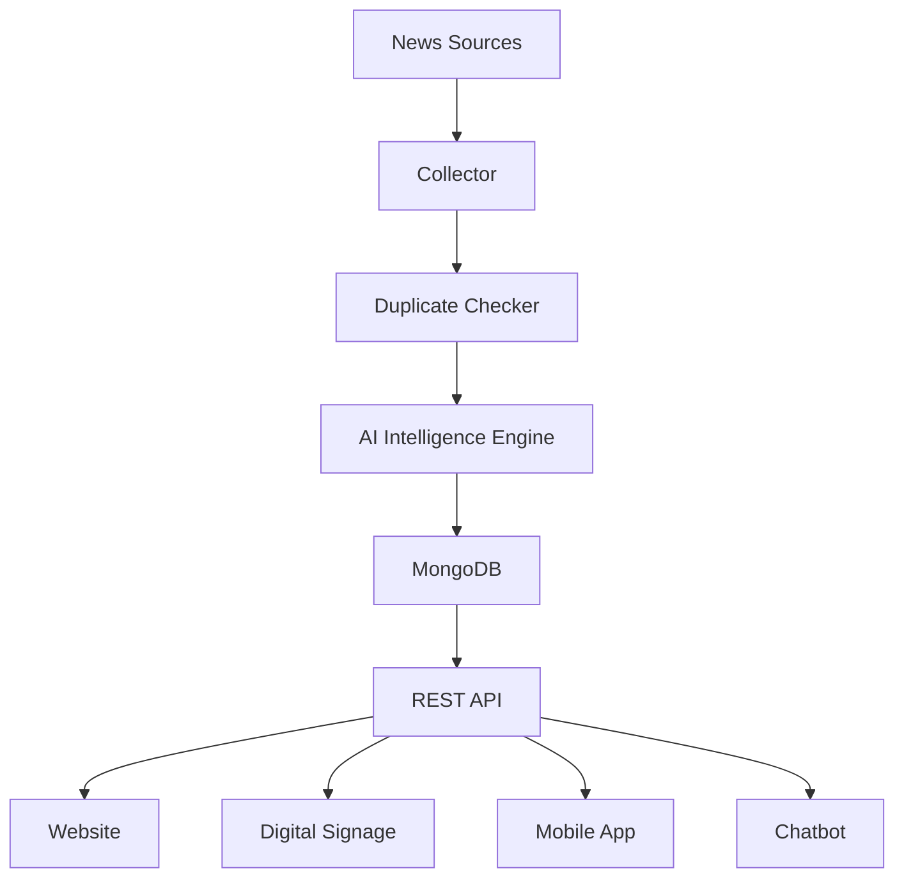
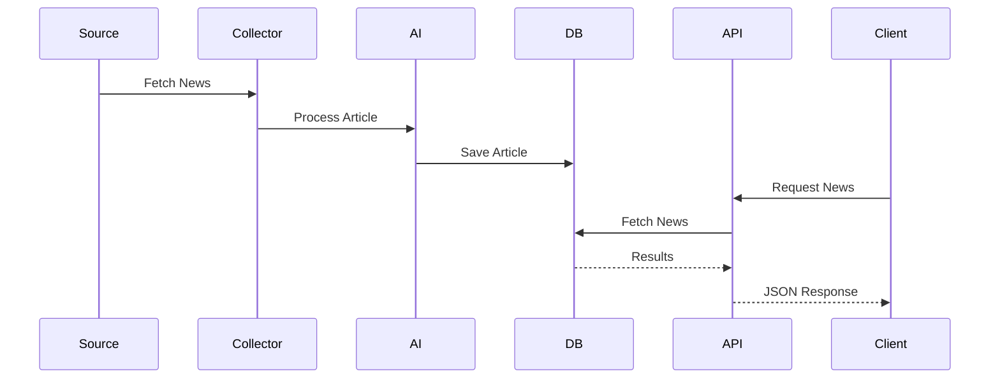

**Version:** 1.0

**Status:** Draft

**Author:** Niharika C

**Last Updated:** August 2026

# Table of Contents

1. Overview
2. Architectural Style
3. High-Level Architecture
4. System Modules
5. Data Flow
6. Component Responsibilities
7. Request Lifecycle
8. Folder Structure
9. Future Expansion
10. Design Principles

# 1. Overview

AI Radar is designed as a modular AI-powered news intelligence platform.

Instead of tightly coupling every feature together, each module performs one well-defined responsibility.

This architecture allows future applications—including websites, digital signage systems, mobile applications, and chatbots—to consume the same backend APIs without modification.


# 2. Architectural Style

The system follows a layered modular architecture.

```
                    Clients

 Website • Signage • Mobile • Chatbot

                     │

                 REST API

                     │

           Business Logic Layer

                     │

          AI Intelligence Engine

                     │

            Data Collection Layer

                     │

               External Sources
```

````

Each layer communicates only with the layer directly below it.

# 3. High-Level Architecture



# 4. System Modules

## 4.1 News Collector

### Purpose

Collect news from trusted sources.

### Responsibilities

* Fetch articles
* Extract metadata
* Normalize data
* Pass articles to the processing pipeline

### Input

External news source

### Output

Raw article object

## 4.2 Duplicate Checker

### Purpose

Prevent duplicate storage.

### Responsibilities

* Compare URLs
* Compare titles
* Detect repeated articles

### Output

Unique article

## 4.3 AI Intelligence Engine

This is the core of AI Radar.

It performs multiple AI tasks.

### Relevance Detection

Determines whether an article is genuinely related to Artificial Intelligence.

Possible outputs

* Relevant
* Irrelevant
* Needs Review (future)

### Category Classification

Version 1 Categories

* Healthcare
* Education
* Agriculture
* Government
* Industry
* Robotics
* Research
* Finance
* Environment
* Cybersecurity
* Others

### Summary Generation

Produces a concise summary of approximately 2–3 sentences while preserving factual accuracy.

### Keyword Extraction

Example

```
Machine Learning

Healthcare

Computer Vision

Cancer Detection
```
### Future Tasks

* Importance ranking
* Sentiment analysis
* Trend detection

## 4.4 Database Layer

Stores processed articles.

Primary responsibilities

* Save articles
* Retrieve articles
* Search
* Filtering

## 4.5 REST API

Acts as the communication interface between AI Radar and client applications.

Examples

```
GET /news

GET /news/latest

GET /news/category/{category}

GET /news/search
```


## 4.6 Scheduler

Runs periodically.

Responsibilities

* Start news collection
* Retry failures
* Log execution

# 5. Data Flow


# 6. Component Responsibilities

| Component         | Responsibility      |
| ----------------- | ------------------- |
| Collector         | Fetch news          |
| Duplicate Checker | Remove duplicates   |
| AI Engine         | Analyze articles    |
| Database          | Store information   |
| Scheduler         | Automation          |
| REST API          | Provide data        |
| Clients           | Display information |


# 7. Request Lifecycle

When a user requests

```
GET /news/latest
```

The following happens

1. Request reaches FastAPI.

2. API validates request.

3. Database retrieves latest articles.

4. Articles returned as JSON.

5. Client displays articles.

# 8. Folder Structure

```
backend/

app/

api/

collector/

intelligence/

scheduler/

database/

models/

services/

utils/

config/

main.py
```

Each folder has one responsibility.

# 9. Scalability

Future modules can be added without changing existing modules.

Examples

Future additions

* Research Paper Collector
* GitHub Repository Collector
* AI Tool Collector
* Internship Collector
* Hackathon Collector

Each new collector should integrate with the same AI Intelligence Engine.

# 10. Design Principles

AI Radar follows the following principles.

## Single Responsibility Principle

Each module performs only one task.

## Loose Coupling

Modules communicate through clearly defined interfaces.

## Reusability

The same API should support multiple client applications.

## Extensibility

Adding new features should require minimal changes to existing code.

## API First

Every client consumes the same REST API.

## Platform First

AI Radar is designed as a platform rather than a standalone application.


# Architecture Summary

The architecture separates news collection, AI processing, storage, and API delivery into independent modules.

This modular design improves maintainability, scalability, and enables multiple client applications—including digital signage systems, websites, chatbots, and future mobile applications—to consume the same processed AI news.
